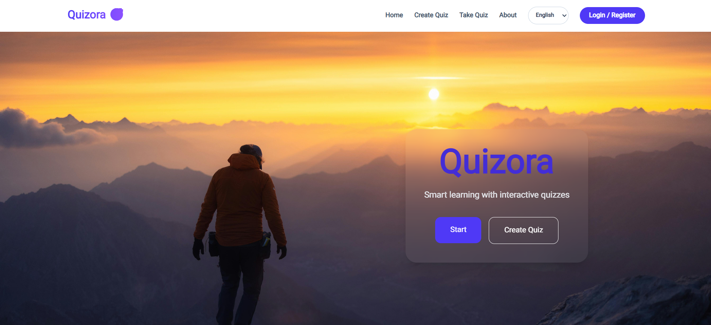

# React Quiz App (Quizora)

A React + Vite quiz application built for the roadmap.sh Quiz App project.

## Repository Layout

- `Quiz-v2`: current and recommended version

If you want to run or deploy this project, use `Quiz-v2`.

## Homepage Preview



## Features (Quiz-v2)

- User authentication flow (register/login)
- Protected pages for quiz and profile areas
- Create custom quizzes with multiple questions and 4 options per question
- Take quizzes and get a final score
- Persist auth state, users, and quizzes in `localStorage`
- Animated route and auth transitions with Framer Motion
- Toast notifications for auth feedback
- Responsive UI built with Tailwind CSS

## Tech Stack

- React 19
- Vite 7
- React Router DOM 7
- Tailwind CSS 4
- Framer Motion
- React Hot Toast
- React Leaflet

## Getting Started

```bash
cd Quiz-v2
npm install
npm run dev
```

Open the local URL shown by Vite (usually `http://localhost:5173`).

## Available Scripts (Quiz-v2)

```bash
npm run dev
npm run build
npm run preview
npm run lint
```

## Main Routes (Quiz-v2)

- `/` home page
- `/about` about page
- `/auth` login/register page
- `/quiz` quiz list page (requires login)
- `/create-quiz` create quiz page (requires login)
- `/quiz/:id` take a specific quiz (requires login)
- `/profile` user profile (requires login)
- `*` custom 404 page

## Data Persistence

The app stores data in browser `localStorage`:

- `token`: current auth token
- `user`: current logged-in user
- `quizzes`: created quizzes
- `LOCAL_USERS`: locally registered users


